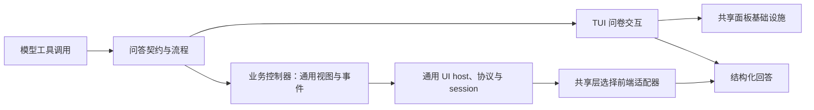

# ask-user-question

## 功能简介

模型工具 `ask_user_question` 支持单选、多选和自定义回答；TUI 使用标签页问卷，RPC 使用原生对话框，非交互模式不注册工具。

## 架构



`index.ts` 注册工具和事件；`core.ts` 仅定义问答契约、答案构造与工具响应。
`controller.ts` 拥有非 TUI 的顺序作答、草稿和确认规则，生成通用 UI 节点并处理
语义事件；`interaction.ts` 只通过通用 UIHost 运行用例，不知道具体前端。
扩展入口调用共享 bindUIHost 并在结束时 dispose；适配器创建与资源协调留在
`shared/ui/host/`。`tui.ts`、`ui/` 暂时保留原终端交互与共享停靠面板。

RPC 改用选项编辑及显式 Confirm answer；多选不再输入数字列表，自定义文本不再
解析 `text:` 前缀。取消仍保留已确认答案。工具 schema、结果与生命周期事件不变。

## 配置

在 agent 目录的 `pi-kits.json` 中设置 `askUserQuestion`，修改后执行 `/reload`。以下为默认值：

```json
{
  "askUserQuestion": {
    "enabled": true
  }
}
```

`multiSelect` 是工具参数，默认 `false`，不是配置项。等待回答通知遵循 `notify.enabled`。操作和事件见[使用说明](docs/usage.md)。

完整字段见[配置示例](../../pi-kits.example.json)。
