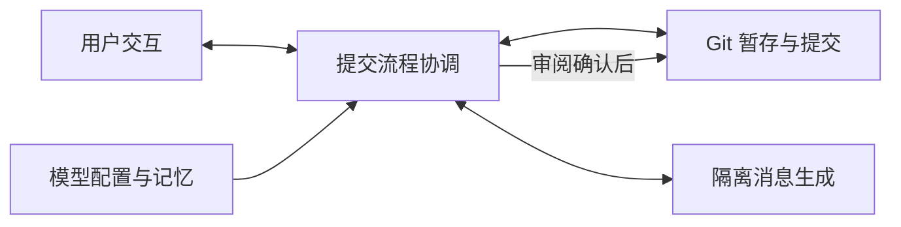

# commit

## 功能简介

`/commit` 确认暂存文件并生成 Conventional Commits 消息，支持审阅、重生成或取消；`pi --commit` 可在启动时触发。

## 架构



`index.ts` 编排流程；`ui.ts` 提供交互；`core.ts` 处理 Git、模型记忆和无工具的 `pi -p` 生成子进程。

## 配置

在 agent 目录的 `pi-kits.json` 中设置 `commit`，修改后执行 `/reload`。以下为默认值：

```json
{
  "commit": {
    "enabled": true,
    "timeoutMs": 120000,
    "rememberModel": true
  }
}
```

可选 `model` 和 `thinking` 控制生成；`lastModel` 保存上次选择。启动触发仅在成功提交后退出。详见[使用说明](docs/usage.md)。

完整字段见[配置示例](../../pi-kits.example.json)。
