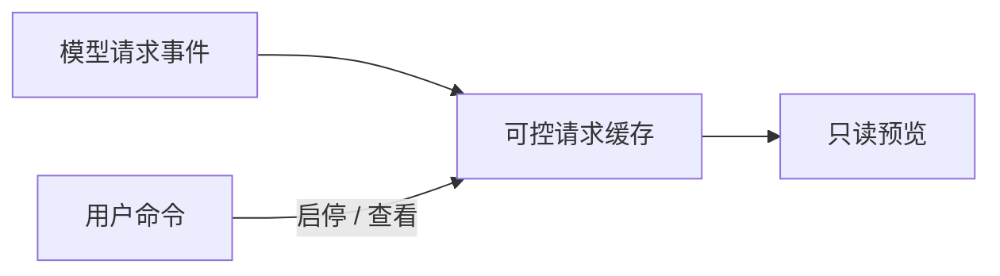

# context-preview

## 功能简介

通过 `/context-preview` 查看最近缓存的模型请求 payload；`start`、`stop`、`status` 控制和查看缓存状态。

## 架构



`index.ts` 监听 `before_provider_request` 并缓存请求；`../../shared/readonly-preview.ts` 提供只读预览。

## 配置

在 agent 目录的 `pi-kits.json` 中设置 `contextPreview`，修改后执行 `/reload`。以下为默认值：

```json
{
  "contextPreview": {
    "enabled": true
  }
}
```

缓存默认关闭，需先运行 `/context-preview start`。预览需要 TUI，共用 `terminal.editor`（默认 `nvim`）。

完整字段见[配置示例](../../pi-kits.example.json)。
