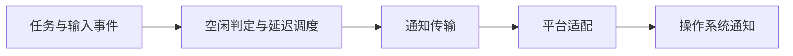

# notify

## 功能简介

TUI 任务结束并保持空闲后，发送尽力而为的桌面通知，仅显示完成、失败、中止或达到 token 上限的状态，不显示回复摘要或错误详情。新输入或新任务会取消待发通知。

## 架构



`index.ts` 处理 Pi 生命周期和延迟；`../../shared/notifications/` 提供通知 API 及平台适配脚本。

## 配置

在 agent 目录的 `pi-kits.json` 中设置 `notify`，修改后执行 `/reload`。以下为默认值：

```json
{
  "notify": {
    "enabled": true,
    "quietPeriodMs": 1000
  }
}
```

macOS 需 `terminal-notifier`，Linux 需 `notify-send`，Windows/WSL 使用 PowerShell。详见[通知说明](docs/usage.md)。

完整字段见[配置示例](../../pi-kits.example.json)。
