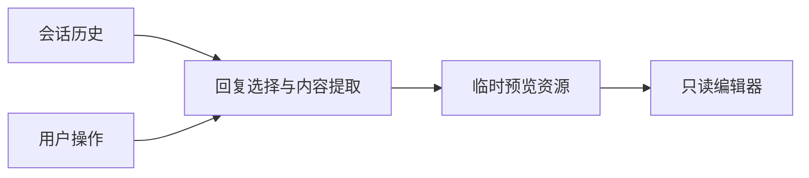

# preview

## 功能简介

`/preview [--thinking]` 选择当前分支回复并只读预览；`Alt+P` 直接查看最新回复。需要 TUI 模式。

## 架构



`index.ts` 提取会话回复；`../../shared/readonly-preview.ts` 管理临时文件和只读编辑器启动。

## 配置

在 agent 目录的 `pi-kits.json` 中设置 `preview`，修改后执行 `/reload`。以下为默认值：

```json
{
  "preview": {
    "enabled": true
  }
}
```

共用 `terminal.editor`（默认 `nvim`），编辑器需支持 `-R`。

完整字段见[配置示例](../../pi-kits.example.json)。
