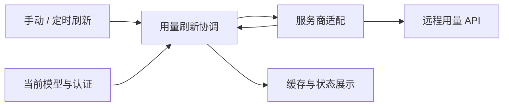

# provider-usage

## 功能简介

显示 DeepSeek 账户余额或 ChatGPT plan 额度；`/usage` 手动刷新，默认每 10 分钟自动刷新。

## 架构



`index.ts` 管理 widget、轮询和生命周期；`source.ts` 选择数据源，`deepseek.ts`、`chatgpt.ts` 适配服务商。

## 配置

在 agent 目录的 `pi-kits.json` 中设置 `providerUsage`，修改后执行 `/reload`。以下为默认值：

```json
{
  "providerUsage": {
    "enabled": true,
    "intervalMs": 600000,
    "timeoutMs": 15000
  }
}
```

认证来自 Pi 模型注册表，无需在此配置凭据。

完整字段见[配置示例](../../pi-kits.example.json)。
