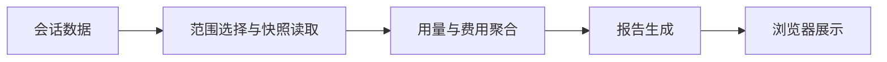

# stats

## 功能简介

`/stats` 生成并打开 HTML 报告，汇总会话 Token、费用、模型和每日用量。

## 架构



`index.ts` 选择会话目录；`core.ts` 聚合数据；`html.ts` 和 `template.html` 生成报告，通过共享桌面启动器打开。

## 配置

在 agent 目录的 `pi-kits.json` 中设置 `stats`，修改后执行 `/reload`。以下为默认值：

```json
{
  "stats": {
    "enabled": true
  }
}
```

完整字段见[配置示例](../../pi-kits.example.json)。
