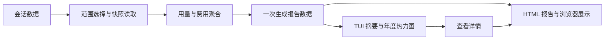

# stats

## 功能简介

`/stats` 在 Pi 终端内展示今日、本月和累计 Token，以及按年的每日用量热力图。
默认显示当前年，PgUp/PgDn（或 `[` / `]`）切换年份；方向键选择日期，查看当天精确用量。
热力图固定每格一列、间隔一列，不随终端宽度伸缩；宽窗口显示完整一年，窄窗口随所选日期横向移动。摘要不随所选年份变化，日期按本地时区计算。
Token 包含输入、输出、缓存读取和缓存写入。

点击面板中的「查看详情」或按 Enter，生成并在浏览器中打开完整 HTML 报告，查看费用、模型和每日用量。Esc 关闭面板，不生成 HTML。支持鼠标的终端模式可点击操作，其余模式使用键盘。
RPC 模式保留直接打开 HTML 报告的行为。

## 架构



`index.ts` 选择会话目录；`core.ts` 聚合数据；`report.ts` 一次计算摘要、每日总量和模型/时间段统计，生成不依赖 UI 的 JSON 数据，供 TUI 和 HTML 共用。`calendar.ts` 负责纯数据的年度网格与强度计算，TUI 按年份缓存，不随重绘重新计算。`tui.ts` 使用 `shared/ui/docked-panel/` 展示统计面板；`html.ts` 和 `template.html` 渲染详细报告，通过共享桌面启动器打开。

## 配置

在 agent 目录的 `pi-kits.json` 中设置 `stats`，修改后执行 `/reload`。以下为默认值：

```json
{
  "stats": {
    "enabled": true
  }
}
```

完整字段见[配置示例](../../pi-kits.example.json)。
