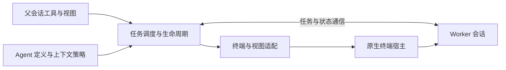

# Subagent

## 功能简介

通过 Pi 或 Codex runtime 执行独立任务，默认后台运行，Herdr 提供原生终端视图。
支持自定义 Markdown agent、引导、取消及保留会话续跑；父上下文克隆仅支持 Pi → Pi。
Codex 使用独立 app-server，默认 workspace-write sandbox、never 审批策略。
Codex 原生视图只在任务结束后开放；退出原生 TUI 后才能继续受管任务，关闭视图仅脱离。
提供六个工具：`subagent`、`resume_subagent`、`list_subagent_types`、
`get_subagent_result`、`steer_subagent`、`stop_subagent`。
TUI 使用 `/subagent:views` 管理终端视图，编辑器上方显示实时任务状态。
不支持调度、worktree、跨进程恢复或自动重连；worker 不是沙箱。

Markdown agent 的 `prompt_mode` 仅支持 Pi，默认 `replace`：通过 CLI 正文文件替换
system prompt，并传入空 append 文件屏蔽发现的 `APPEND_SYSTEM.md`。
`append` 保留 Pi 自身基础提示词，以 agent 正文替换发现的 `APPEND_SYSTEM.md`。
两种模式均按 Pi 原生信任规则保留项目 `AGENTS.md`/`CLAUDE.md`；非 Pi runtime
显式配置此字段会报错。详见[使用文档](docs/usage.md#user-defined-agent-types)。

## 架构



- [index.ts](index.ts)：启用检查、工具/命令注册、会话生命周期与完成消息。
- [manager.ts](manager.ts)：任务轮次、FIFO 并发队列、结果与视图管理。
- [runtime.ts](runtime.ts) / `runtimes/`：执行会话接口、Pi bridge 与 Codex app-server 适配。
- [mux.ts](mux.ts) / [herdr.ts](herdr.ts)：终端适配接口与 Herdr 实现，不自建 PTY。
- [worker.ts](worker.ts) / [protocol.ts](protocol.ts)：Pi worker 的认证 loopback TCP JSONL 桥接。
- [agents.ts](agents.ts) / [clone.ts](clone.ts)：用户定义加载与独立 Pi 分支克隆。
- `views.ts`、`status-widget.ts`、`presentation.ts`、`renderers.ts`：TUI 展示。

包 manifest 仅加载 `index.ts`；worker 由子 Pi 显式通过 `-e` 加载。
完成的执行会话保留供查看/续跑；Codex 原生 TUI 惰性启动，关闭视图仅脱离。
父会话退出或重载清理拥有的执行后端和终端，不使用用户的全局 Codex daemon。

## 配置

在 agent 目录的 `pi-kits.json` 中配置，修改后执行 `/reload`：

```json
{
  "subagent": {
    "mux": "herdr",
    "enabled": true,
    "maxConcurrent": 4,
    "extensionAllowlist": ["builtin:codemode", "builtin:tool-search"]
  }
}
```

须显式设置 `mux: "herdr"` 且 `HERDR_ENV === "1"`；否则不注册工具、命令或钩子。
`enabled` 默认 `true`；`maxConcurrent` 为 1–32 的整数，默认 4，仅限制执行任务。
allowlist 整体替换默认值，`[]` 只加载 worker 桥；详见[使用文档](docs/usage.md)与[配置示例](../../pi-kits.example.json)。
