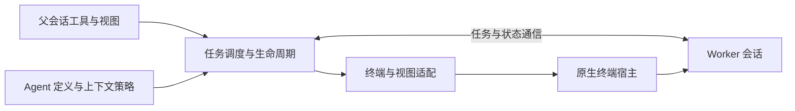

# Subagent

## 功能简介

通过 Pi 或 Codex runtime 执行独立任务，默认后台运行，Herdr 提供原生终端视图。
支持自定义 Markdown agent、引导、取消及保留会话续跑；父上下文克隆仅支持 Pi → Pi。
Codex 使用独立 app-server，默认 workspace-write sandbox、never 审批策略。
Codex 运行中也可打开可交互原生视图；新一轮受管任务仍需先退出原生 TUI，关闭视图仅脱离。
提供六个工具：`subagent`、`resume_subagent`、`list_subagent_types`、
`get_subagent_result`、`steer_subagent`、`stop_subagent`。
TUI 使用 `/subagent:views` 管理终端视图，编辑器上方显示实时任务状态。
不支持调度、worktree、跨进程恢复或自动重连；worker 不是沙箱。

Markdown agent 的 runtime 专属字段全部放在 `runtime_config` 下：Pi 使用
`tools`、`disallowed_tools`、`prompt_mode`、`inherit_context`，Codex 使用 `runtime_args`。
通用 parser 仅读取支持的通用元数据，忽略未知顶层字段；`model`、`thinking`、
Markdown 正文仍为通用配置。旧顶层 runtime 专属字段没有效果，须移入 `runtime_config`，
不提供兼容别名。各 runtime 仅读取并校验自己的字段；未知或其他 runtime 的字段一律忽略，
即使其值格式错误也不解释或校验。Pi 的 `inherit_context` 由 `runtime.prepareSpawn`
在入队前从 host 提供的不透明上下文捕获父会话分支；续跑不会再次捕获。

`subagent` 和 `resume_subagent` 的共享工具允许未知额外字段，但仅读取已知通用字段，
原样转发 `runtime_config`；顶层 `review_target` 被忽略。首次调用可同时提供会话和任务配置，
由 adapter 拆分；agent 定义的自有会话配置逐键优先。Codex 仅读取 `runtime_args` 和
调用中的 `review_target`。agent/会话中的 `review_target` 被忽略，即使值格式错误也不校验，
不会被继承；原生 review 每轮必须在调用中提供新的 target。续跑不可更改所选 runtime 的
自有会话字段，仅允许重复传入归一化后相同的值；未知及外来额外字段仍被忽略。
Pi 工具配置可在首次调用提供，只应用一次并在续跑时保留，不能逐轮修改工具或 prompt 模式。
内部可信 `ManagerOptions` 启动/部署注入不受影响。

Markdown agent 的 `runtime_config.prompt_mode` 仅支持 Pi，默认 `replace`：通过 CLI 正文文件替换
system prompt，并传入空 append 文件屏蔽发现的 `APPEND_SYSTEM.md`。
`append` 保留 Pi 自身基础提示词，以 agent 正文替换发现的 `APPEND_SYSTEM.md`。
两种模式均按 Pi 原生信任规则保留项目 `AGENTS.md`/`CLAUDE.md`；Pi
在启动时校验此自有字段；Codex 忽略所有 Pi 专属字段，包括格式错误的值，不解释工具配置。
原生 review 的调用示例与限制详见[使用文档](docs/usage.md#native-review-and-search)。

## 架构



- [index.ts](index.ts)：启用检查、工具/命令注册、会话生命周期与完成消息。
- [manager.ts](manager.ts)：任务轮次、FIFO 并发队列、结果与视图管理。
- [runtime/index.ts](runtime/index.ts)：执行会话接口；`runtime/pi/` 与 `runtime/codex/` 分别实现各自的配置解析和执行适配。
- [mux/index.ts](mux/index.ts) / [mux/herdr.ts](mux/herdr.ts)：终端适配接口与 Herdr 实现，不自建 PTY。
- [runtime/pi/worker.ts](runtime/pi/worker.ts) / [protocol.ts](runtime/pi/protocol.ts)：Pi worker 的认证 loopback TCP JSONL 桥接。
- [agents.ts](agents.ts)：用户定义加载；[runtime/pi/clone.ts](runtime/pi/clone.ts) 与 [runtime/pi/extensions.ts](runtime/pi/extensions.ts) 分别负责 Pi 分支克隆和 worker 扩展解析。
- `ui/`：`views.ts`、`status-widget.ts`、`presentation.ts`、`renderers.ts` 及其测试，负责 TUI 展示。

包 manifest 仅加载 `index.ts`；worker 由子 Pi 显式通过 `-e` 加载。
完成的执行会话保留供查看/续跑；Codex 原生 TUI 惰性启动，关闭视图仅脱离。
父会话退出或重载清理拥有的执行后端和终端，不使用用户的全局 Codex daemon。

## 配置

在 agent 目录的 `pi-kits.json` 中配置，修改后执行 `/reload`：

```json
{
  "subagent": {
    "mux": "herdr",
    "enabled": true,
    "maxConcurrent": 4,
    "extensionAllowlist": ["builtin:codemode", "builtin:tool-search"]
  }
}
```

须显式设置 `mux: "herdr"` 且 `HERDR_ENV === "1"`；否则不注册工具、命令或钩子。
`enabled` 默认 `true`；`maxConcurrent` 为 1–32 的整数，默认 4，仅限制执行任务。
allowlist 整体替换默认值，`[]` 只加载 worker 桥；详见[使用文档](docs/usage.md)与[配置示例](../../pi-kits.example.json)。
