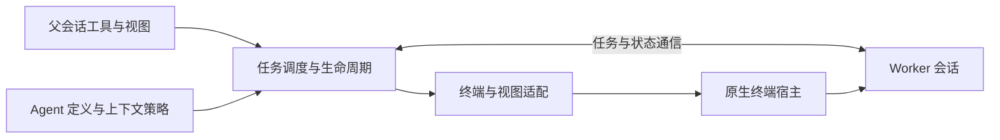

# Subagent

## 功能简介

通过 Pi 或 Codex runtime 执行独立任务，默认后台运行，Herdr 提供原生终端视图。
支持自定义 Markdown agent、引导、取消及显式保留会话续跑；父上下文克隆仅支持 Pi → Pi。
Codex 使用独立 app-server，默认 workspace-write sandbox、never 审批策略。
所有 runtime 统一要求上轮结束、会话 idle 且 connected 才能 resume；running 仅支持 steer 当前托管任务，interactive 禁止托管 resume/steer。
TUI 存活、视图打开/正在打开/脱离不影响提交资格。Codex 运行中也可打开原生视图，关闭视图仅脱离。
已知缺陷：Codex 不能可靠将原生忙碌映射为 interactive，Manager 无法保证识别并阻止此时的操作，详见[使用文档](docs/usage.md)。
提供六个工具：`subagent`、`resume_subagent`、`list_subagent_types`、
`get_subagent_result`、`steer_subagent`、`stop_subagent`。
TUI 使用 `/subagent:views` 管理终端视图，编辑器上方显示实时任务状态。
不支持调度、worktree、跨进程恢复或自动重连；worker 不是沙箱。

Runtime 专属字段统一放在 `runtime_config` 下；`model`、`thinking`、Markdown 正文仍为通用配置。
字段作用域、未知/外来字段忽略、agent 与调用的逐键优先级及续跑继承规则，
统一见[配置文档](docs/configuration.md#runtime-configuration)。
父上下文捕获与续跑行为见[Parent context cloning](docs/usage.md#parent-context-cloning)。

Markdown agent 的 `runtime_config.prompt_mode` 仅支持 Pi，默认 `replace`：通过 CLI 正文文件替换
system prompt，并传入空 append 文件屏蔽发现的 `APPEND_SYSTEM.md`。
`append` 保留 Pi 自身基础提示词，以 agent 正文替换发现的 `APPEND_SYSTEM.md`。
两种模式均按 Pi 原生信任规则保留项目 `AGENTS.md`/`CLAUDE.md`。
原生 review 的调用示例与限制详见[使用文档](docs/usage.md#native-review-and-search)。

## 架构

逐层接口、必选/可选成员、生命周期与资源所有权、扩展接入和测试要求，见
[架构与实现契约](docs/architecture.md)。操作流程见 [usage.md](docs/usage.md)，
配置字段与优先级见 [configuration.md](docs/configuration.md)。



- [index.ts](index.ts)：启用检查、工具/命令注册、会话生命周期与完成消息。
- [manager.ts](manager.ts)：任务轮次、FIFO 并发队列、结果与视图管理。
- [runtime/index.ts](runtime/index.ts)：执行会话接口；`runtime/pi/` 与 `runtime/codex/` 分别实现各自的配置解析和执行适配。
- [mux/index.ts](mux/index.ts) / [mux/herdr.ts](mux/herdr.ts)：终端适配接口与 Herdr 实现，不自建 PTY。
- [runtime/pi/worker.ts](runtime/pi/worker.ts) / [protocol.ts](runtime/pi/protocol.ts)：Pi worker 的认证 loopback TCP JSONL 桥接。
- [agents.ts](agents.ts)：用户定义加载；[runtime/pi/clone.ts](runtime/pi/clone.ts) 与 [runtime/pi/extensions.ts](runtime/pi/extensions.ts) 分别负责 Pi 分支克隆和 worker 扩展解析。
- `ui/`：`views.ts`、`status-widget.ts`、`presentation.ts`、`renderers.ts` 及其测试，负责 TUI 展示。

包 manifest 仅加载 `index.ts`；worker 由子 Pi 显式通过 `-e` 加载。
任务完成后，没有打开的原生视图且 `keep_alive` 未开启时自动释放执行资源，保留结果与会话文件。
打开的视图保持会话驻留；关闭视图不会取消运行中任务，但已完成任务会释放。
`keep_alive: true` 在创建时固定，允许后续续跑，直到用户删除或父会话退出；agent 定义优先于调用参数。
释放后的会话不能续跑或重新打开原生视图。Codex 原生 TUI 惰性启动。
父会话退出或重载清理拥有的执行后端和终端，不使用用户的全局 Codex daemon。

## 配置

完整的扩展设置、Markdown agent 字段、Pi/Codex runtime 参数、默认值、优先级及续跑规则，
见[Subagent 配置文档](docs/configuration.md)。

最小启用配置写入 agent 目录的 `pi-kits.json`，修改后执行 `/reload`：

```json
{
  "subagent": {
    "mux": "herdr",
    "enabled": true,
    "maxConcurrent": 4,
    "extensionAllowlist": ["builtin:codemode", "builtin:tool-search"]
  }
}
```

须显式设置 `mux: "herdr"` 且 `HERDR_ENV === "1"`；否则不注册工具、命令或钩子。
`enabled` 默认 `true`；`maxConcurrent` 为 1–32 的整数，默认 4，仅限制执行任务。
allowlist 整体替换默认值，`[]` 只加载 worker 桥；详见[扩展加载配置](docs/configuration.md#worker-extension-allowlist)与[配置示例](../../pi-kits.example.json)。
