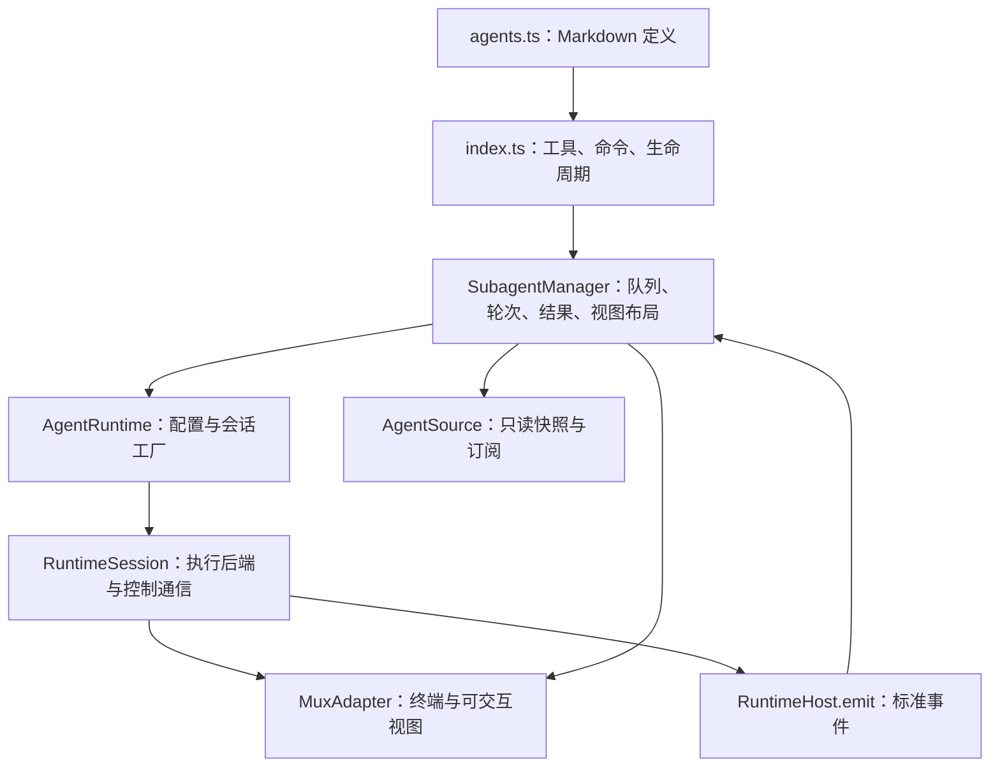

# Subagent 架构与实现契约

本文面向新增、替换或测试实现的开发者。操作流程见 [usage.md](usage.md)，
配置字段与优先级见 [configuration.md](configuration.md)；
接口签名以链接的 TypeScript 源码为准。下文区分 **TypeScript 必需成员** 与
**运行时行为契约**：实现接口能通过类型检查，并不代表资源所有权、轮次或清理行为正确。

## 分层与扩展边界



| 层 | 实现入口 / 接口 | 是否为可替换接口 |
| --- | --- | --- |
| Pi 扩展入口 | [index.ts](../index.ts)，`registerSubagents` | 具体注册函数，不存在通用入口 adapter 接口 |
| Agent 定义 | [agents.ts](../agents.ts)，`AgentDefinition` | 数据模型与加载函数，不是执行 runtime |
| 调度与生命周期 | [manager.ts](../manager.ts)，`SubagentManager` / `ManagerOptions` | 具体类；构造器注入 mux 和 runtimes |
| 执行适配 | [runtime/index.ts](../runtime/index.ts)，`AgentRuntime` / `RuntimeSession` | 新增 runtime 必须实现的接口 |
| 终端适配 | [mux/index.ts](../mux/index.ts)，`MuxAdapter` | 新增终端宿主必须实现的接口 |
| 展示 | [ui/presentation.ts](../ui/presentation.ts)，`AgentSource` | UI 的最小数据源接口；不要求整个 manager API |
| Pi worker 桥 | [runtime/pi/worker.ts](../runtime/pi/worker.ts)、[protocol.ts](../runtime/pi/protocol.ts) | Pi 内部通信协议，不是所有 runtime 必须实现的接口 |

Manager 负责受管任务，runtime 负责执行后端，mux 负责宿主中的终端和视图。
Codex app-server 与其原生 TUI 是不同资源；不要把“关闭视图”“停止任务”“关闭后端”视为同一操作。

## 1. 扩展入口与 Agent 定义

`registerSubagents(pi, adapter, maxConcurrent?, extensionAllowlist?)` 注册六个工具、
`/subagent:views`、完成消息 renderer 和会话钩子，并惰性创建 manager/widget。
它不自行检查 adapter 环境；调用方应先执行无副作用的 `adapter.check_env()`。

默认导出还负责：

- `PI_KITS_SUBAGENT_WORKER === "1"` 时不注册父协调器，避免 worker 递归注册。
- 使用 `@pi-kits/config` 读取配置；仅在启用且 `mux === "herdr"`、环境检查通过时注册。
- 将工具的 `runtime_config` 作为原始调用参数交给 runtime 分区解析。
- 将视图面板返回的操作映射到 manager，并处理复制、确认删除等 UI 行为。
- `session_shutdown` 时销毁 widget 并关闭 manager；清理失败最多尝试三次，不提前丢弃所有权。

工具参数 schema、执行和返回值在 [index.ts](../index.ts)；受管任务操作返回文本 JSON
及 `details: AgentSnapshot`。完成消息与原生用户交互消息使用不同的通知策略。
不要在 runtime、mux 或展示 helper 中注册工具、命令或 Pi 生命周期钩子。

`AgentDefinition` 由 Markdown 文件名、frontmatter 和正文解析而来。加载规则见
[User-defined agent types](configuration.md#user-defined-agent-types)。新增 runtime 不应往 agent
加载器添加 runtime 专属字段校验；加载器保存 `runtime_config`，具体解释由 runtime 完成。

## 2. Manager：调度与公开操作

构造器为 `new SubagentManager(adapter, options?)`。主要注入项：

- `runtimes`：自定义 `AgentRuntime[]`，在默认 Pi/Codex 后加入内部 map；同 ID 的后加入项替换前项。
- `maxConcurrent`：FIFO 受管任务并发限制，不限制空闲保留会话的数量。
- `onComplete` / `onSessionUpdate`：受管轮次与原生用户交互的通知回调。
- 启动/取消超时、可执行文件、Pi worker 路径与扩展 allowlist：见 `ManagerOptions`。

不存在独立的 runtime registry 文件或公开的 `registerRuntime()` 方法；registry 是 manager 的内部 map。
当前 `extensionAllowlist`、`workerPath`、旧 `executable` 回退只向 Pi 传递；
其他 runtime 的可执行文件可通过 `runtimeExecutables[id]` 注入。

| 方法 | 实现调用方应遵守的语义 |
| --- | --- |
| `list()` / `get(id)` / `subscribe(listener)` | 获取快照与变更通知；`subscribe` 返回退订函数，不暴露内部 record |
| `runtimeCapabilities(id)` | 查询已注册 runtime 的能力；未知 ID 明确报错 |
| `spawn(SpawnOptions)` | 同步解析、校验并入队，返回当前快照；排到执行槽后启动资源 |
| `resume(id, ResumeOptions)` | 仅复用已完成轮次、仍连接且 idle 的保留会话；不重新启动后端 |
| `result(id, wait?, signal?)` | 可等待调用时的轮次完成；取消等待不等于取消子任务 |
| `steer(id, message)` | 仅对 connected、sessionState running 且支持 steer 的当前托管任务发送；interactive 禁止；可等待异步投递 |
| `stop(id)` | 返回即时快照，取消/强制清理可能仍在进行；不是完成屏障 |
| `openView(id)` / `closeView(id)` | 打开或聚焦 attachment / 脱离视图；manager 决定布局并串行化视图操作 |
| `release(id)` | 仅释放已完成任务的执行资源，保留 record 和结果；之后不能续跑或开视图 |
| `remove(id)` | 关闭拥有资源后删除 record，不删除会话文件；失败时保留记录供重试 |
| `close()` | 关闭整个 manager；失败可重试，已成功关闭的 session 不重复清理 |
| `backgroundPreference(id)` | 返回创建时记录的后台偏好，供入口决定是否等待 |

`status` 是受管轮次状态，`sessionState` 是后端状态，两者不能混用。
`completed/stopped/error` 不一定表示 session 已关闭；`idle` 也不等于最新受管任务成功。
自动释放条件和 `keep_alive` 行为见 [Automatic runtime release](usage.md#automatic-runtime-release)。

清理失败不能当成成功：manager 保留失败资源及必要的并发槽，直到清理完成。
展示或通知回调失败不得改变任务执行结果。

### 状态与 policy 边界

[state.ts](../state.ts) 是 runtime-neutral 的类型与分类单一来源：受管 `AgentStatus`、
后端 `BackendSessionState/SessionState`、terminal/working 分类。Pi protocol 的
`WorkerSessionState` 名称只是兼容导出，manager 不再从 Pi 协议取得后端状态类型。
[policy.ts](../policy.ts) 是 extension 内部的纯判断模块，不注册命令、工具或事件，
不存储状态，也不是新的 readiness 系统、操作网关或 CAS。

- `resumeBlocker` 按 closed/released → unfinished → cleanup → connected/retained → idle
  返回有序错误原因；不拿受管 status 代替 execution.finished。终态、甚至 disconnected
  的受管 status 本身不排除已完成且仍 connected/idle 的会话。
- `steerBlocker` 要求真实 running 的受管轮次和后端、unfinished、dispatched、connected，
  然后检查当前 session 的 steer capability；展示 active 不能作为操作权限。
- `dispatchBlocker` 仅共享启动/续跑投递前的小型规则。新 round 本来就是 unfinished，
  不能复用 resume 的完成前提。startup 断连仍是普通 Error 并清理；busy 和排队续跑
  复检失败仍是 RuntimeTaskRejectedError，不因此取消原生任务。
- `nativeViewBlocker` 使用真实 finished、当前 session capability 和清理所有权。
  `nativeViewHint` 仅供 UI：snapshot 缺少 finished、连接与清理事实，terminalId 也不能
  绕过非终态轮次的 concurrentNativeInput 检查；最终权限仍由 manager 判断。
  openView 在 attachment、视图探测、focus/open 的 await 后复用相同 policy 复检，
  不阻止 idle resume。open 已开始后失去权限，只回滚本次新建视图；关闭失败保留
  自有 view，供 close/release/stop 重试，不关闭原已存在或其他 agent 的视图。
- `canAutoRelease` 共享同步资格；manager 保留 round identity，并在排队执行及 await
  liveView 后重新读取资格。keepAlive、interactive、release/dispose 改变不能被旧检查覆盖。
- `isDisplayActive/hasDisplayError` 用于标题、widget、renderer 与面板的展示意图；
  active 包含原生 interactive，不表示可 resume、steer 或打开可写视图。

审视后保留的局部判断：简单状态转换（queued/starting/stopping、idle 更新）、释放的
finished 前提、队列并发计数、完成通知 claims、round/sequence identity 和 stale-event
过滤仍在 manager，因为它们是转换/所有权而不是重复权限。stop 的 queued 或 reused
但未 dispatched 分支与发送失败分类含义不同，不合并成万能 isBusy。view 轮询的计时资格
也不同于自动释放资格，不能因 interactive 禁止释放就停止追踪现存视图。
Pi transport 的 socket/authentication/closed、worker 的 active/preparing/started/canceling
与 generation 仍属 Pi；重复的 native preflight 用 `nativeInputPending`，同时观察 host idle，
保留 await auth 后的复检。Codex 的 thread idle、turnId/finishing、native hydration、
submission 等仍属 Codex。原生 finishing/hydration 期间推迟 backend idle 发布；
成功或失败的 session_update 必须先于 idle/autoRelease。完成后用既有 interaction
identity、managed 和 nativeTurnId 复检，旧 hydration 不得覆盖新 turn/round；
manager/Pi 仍保留原生结束后的自动释放语义。控制命令的重复 round 选择由本地 `managedForRound` 统一，
不把内部执行流程搬到 manager，也不扩大已接受的 interactive 映射限制。
入口和共享 panel 的 disposed/finished/opening 是 UI 或注册生命周期，不混入 subagent policy。
表驱动组合验证见 [policy.test.ts](../policy.test.ts)，竞态和清理契约见 manager/runtime 测试。

## 3. Runtime 工厂：`AgentRuntime`

完整签名见 [runtime/index.ts](../runtime/index.ts)。

| 成员 | 必需 | 契约 |
| --- | --- | --- |
| `id` | 是 | registry 的字符串 key，不是固定枚举；默认选择为 `pi` |
| `displayName` | 否 | UI runtime 标签，不用于选择实现 |
| `capabilities` | 是 | 声明 `nativeClone`、`steer`、`retainedSession`、`concurrentNativeInput` 四个布尔能力 |
| `validate(options)` | 是 | 同步验证启动配置；应在资源获取前暴露配置错误 |
| `create(options, host)` | 是 | 返回 session；manager 在 `start()` 前记录其所有权 |
| `parseConfig(config)` | 否 | 解析会话配置；只在未实现 `parseCallConfig` 时作为 spawn 回退 |
| `parseCallConfig(config, sessionConfig, phase)` | 否 | 将调用参数分为固定会话 `runtimeConfig` 和本轮 `runtimeParams`；处理 spawn/resume 差异 |
| `parseTask(command, options)` | 否 | 解析/规范化命令，支持 task、steer、cancel；不得丢失 `round` |
| `prepareSpawn(options)` | 否 | 入队前同步冻结 runtime 专属宿主输入；例如捕获父会话分支并移除活的 context |

解析钩子必须是纯解析：不启动进程、建立 transport 或注册生命周期。
`prepareSpawn` 可捕获宿主数据，但不应提前启动执行后端。
只有 `parseTask` 缺省时 manager 才自行验证 task prompt 非空；自定义解析器应验证自己的输入。
目前支持无 prompt 的 Codex 结构化 review，因此不要给所有 runtime 强加统一 prompt 要求。

能力声明控制通用策略，而不是由 UI 判断 runtime 名字：

- `nativeClone`：可接受自身支持的原生分支快照，不代表跨 runtime 转换。
- `steer`：允许 manager 对运行中任务发送引导。
- `retainedSession`：后端可在轮次结束后保留并复用。
- `concurrentNativeInput`：受管任务运行时可打开可写原生 attachment；不代表可同时启动另一受管轮次。

### 调用顺序

Spawn：

1. 选择 `agent.runtime ?? call.runtime ?? "pi"`，查 registry。
2. 调用 `parseCallConfig(rawCall, agent/sessionConfig, "spawn")`；缺省时使用 `parseConfig` 回退。
3. 生成 UUID 和固定的原生 `sessionName`，组装 `RuntimeOptions`。
4. 调用 `validate`，再调用可选 `prepareSpawn`。
5. 使用 `parseTask` 预检命令并检查序列化大小、clone 能力，创建 record 入 FIFO 队列。
6. 获得并发槽后 `create` → `session.start()` → 再次 `parseTask` → `session.send(task)`。

Resume：

1. 检查旧轮次已完成、session 仍连接、支持保留且 idle，没有释放/清理冲突。TUI 存活、视图打开/正在打开/脱离不影响提交资格；running 只能 steer 当前托管任务，interactive 禁止托管 resume/steer。
2. 调用 `parseCallConfig(freshCall, retainedConfig, "resume")`，不复用旧轮次参数。
3. 递增 `round`，预检新命令并入队；不调用 `prepareSpawn`，不重新 `create/start`。
4. 执行时再次检查 `connected`、`inspect()` 和 idle，再解析、发送新 task。复检后的状态变化仍依赖底层并发处理，本次不新增网关或 CAS。

Codex 保持原有状态映射及 managed 占用、thread idle、连接、turn identity 检查。
已知缺陷：它不能可靠将原生忙碌转换为 `interactive`，Manager 无法保证在原生忙碌时识别并阻止操作。
`nativeAlive` 仍用于原生请求路由及终端清理，不再决定 task/resume 提交资格。

`parseTask` 在预检和真实投递时都可能执行，不能依赖“只调用一次”。
Resume 不再次调用工厂 `validate`，因此会话设置不变、每轮必需参数等规则由调用解析器负责。

## 4. Runtime 会话与标准事件

`RuntimeHost` 提供 `mux` 和 `emit(event)`；runtime 不直接修改 manager record。
`RuntimeEvent` 当前是宽类型 `{ type: string; ... }`，字段契约由 manager 消费代码与测试约束，
并非完整的判别联合；实现不能仅靠类型检查确认事件正确。

### `RuntimeSession` 必需成员

| 成员 | 契约 |
| --- | --- |
| `capabilities` | 当前会话的能力，供续跑与视图操作判断 |
| `connected` | 控制连接可用性，不只是进程存在 |
| `terminal` | 当前原生终端句柄或 `undefined`；后端不必由此终端承载 |
| `start(): Promise<void>` | 等待后端/控制通信准备就绪；成功后可接收命令，失败仍需允许清理 |
| `send(command): void \| Promise<void>` | 投递 task/steer/cancel；返回或 promise 完成不代表任务完成 |
| `inspect(): Promise<boolean>` | 检查可复用执行后端存活，不隐式重新启动或自动重连 |
| `attachment(): Promise<TerminalHandle>` | 返回或惰性创建原生可交互终端；不等于创建新执行后端 |
| `close(): Promise<void>` | 清理该 session 拥有的后端、transport、终端和临时资源；支持启动竞态与失败重试 |

`create` 应只构造拥有者，将资源启动放进 `start`。
`start/attachment` 失败后，必须保留已获取资源的清理路径；`close` 不得因为之前失败而永久失去重试能力。
禁止关闭用户的全局 daemon 或不属于当前 session 的终端。

### Manager 消费的事件

| `type` | 关键字段与行为 |
| --- | --- |
| `started` | 确认受管 task 已被接受，可附模型/会话元数据 |
| `session_state` | `state: idle \| running \| interactive`；interactive 可带 `activity`；同步后端状态 |
| `model_select` | 更新实际模型和会话元数据，不改固定配置展示值 |
| `stats` | 非负安全整数 `turnCount/toolUses/totalTokens/compactionCount`，可选 `contextPercent` 为 0–100 |
| `activity` | 可带 `event/toolName`；`tool_execution_end` 使活动显示回到 Thinking |
| `completed` | 必需字符串 `result`，可带 `canceled/error/truncated/sessionPath/resultSequence`；结束当前受管轮次 |
| `error` | 字符串 `error`；结束当前受管轮次，不等于 transport 已关闭 |
| `disconnected` | 可带 `error`；连接丢失，由 manager 驱动失败与资源清理 |
| `session_update` | `interactionId/sequence/response/outcome`，可带 `truncated/error`；更新原生用户交互回复，不完成受管轮次 |

共同元数据可包含 `model/modelName/runtimeSessionId/sessionPath`。
`ready` 是 Pi transport 的握手事件，由 Pi runtime 消费，不是通用 manager 的完成/接受信号。

轮次与结果顺序：

- 命令有可选 `round`；第一轮可能省略，续跑命令由 manager 标记为当前轮次。
- 事件若携带不匹配的 `round` 会被忽略。第二轮及以后，受管 `started/stats/activity/completed/error`
  必须携带当前轮次；session 状态与断连按会话级规则处理。
- `session_update` 独立于 round，`sequence` 必须是递增的正安全整数；回复不超过 64 KiB。
- 支持原生交互时，`completed.resultSequence` 与交互 `sequence` 应使用一致的结果顺序，
  避免旧受管回复晚到后覆盖新用户回复。空回复不清除此前结果。
- 完成来自实际后端轮次结束，不得把工具结束、CLI 画面或中间重试当成最终回复。

### 错误分类

[RuntimeTaskRejectedError](../runtime/errors.ts) 仅用于 **投递前拒绝且没有触碰原生/用户任务**。
Manager 将该轮次标为 error，但不因此把后端视为断连；是否继续保留仍受自动释放策略约束。
发送后状态不明、transport 失败等不能伪装成该错误，否则会错误保留可能仍在执行的任务。
普通投递错误走断连/清理路径；配置解析错误应在入队前抛出。

## 5. Mux：`MuxAdapter`

完整类型、`StartOptions` 和 `OpenViewOptions` 见 [mux/index.ts](../mux/index.ts)。
所有八个方法均必需：

| 方法 | 契约 |
| --- | --- |
| `check_env(): boolean` | 无副作用的环境检查，不启动 CLI 或创建资源 |
| `start(options): Promise<TerminalHandle>` | 按绝对 cwd、完整 argv 与 env 启动终端；记录资源所有权 |
| `inspect(terminal): Promise<{ alive: boolean }>` | 检查已拥有的终端；不能把宿主错误统统吞成不存在 |
| `destroy(terminal): Promise<void>` | 停止并清理拥有的终端；仅在确认清理成功后释放所有权 |
| `open_view(options): Promise<ViewHandle>` | 可写/可控制 attachment；按 manager 指令布局，不自行选择布局策略 |
| `inspect_view(view): Promise<{ alive: boolean }>` | 检查当前 attachment，关闭、移动或替换后不能追踪到别的 attachment |
| `focus_view(view): Promise<void>` | 聚焦已拥有且有效的视图 |
| `close_view(view): Promise<void>` | 脱离视图，不停止 worker；已关闭或随终端销毁而退役的自有视图可重复关闭 |

`TerminalHandle` / `ViewHandle` 都只有 opaque `id`，作用域为创建它们的 adapter 实例。
不要把这些 ID 当成宿主原生 pane/workspace ID，也不要跨 adapter 实例传递。

`StartOptions.agentId` 为子 agent 完整 UUID，`agentType` 为可选类型；`argv` 包含可执行文件。
Herdr 使用 `sub-<type>-<UUID>` 或 `sub-anonymous-<UUID>` workspace label，
与 runtime 的 `Sub · <type or -> · <initial description>` 原生会话名称不同。

布局由 manager 决定：第一视图 `direction: "right"`；后续视图
`direction: "down", relativeTo: <last surviving view>`。
Adapter 必须校验资源身份，不能因 pane 被移动/替换而操作无关终端。

启动部分成功但回滚未能清理时，抛出 `TerminalStartError(terminal, cause)`，
让 runtime 接管句柄并负责清理；可立即尝试 `destroy`，失败时必须保留句柄供 `close()` 重试，
不能只抛普通错误并丢掉资源。
清理不能确认停止时应报错并保留所有权，而不是仅凭 CLI 返回成功就宣称资源已释放。
参考实现：[HerdrAdapter](../mux/herdr.ts)。

## 6. Pi worker 与原生 transport

Pi runtime 启动携带 worker extension 的原生 Pi 终端，建立一次性认证的 loopback TCP JSONL 桥。
[WorkerCommand / WorkerEvent](../runtime/pi/worker.ts) 描述 wire 数据；
[protocol.ts](../runtime/pi/protocol.ts) 定义 64 KiB 命令/结果预算、32 个待处理命令上限和会话状态。

修改 Pi 桥接实现时必须保持：

- LF 分隔 JSON，验证 ready 的 ID/token；错误帧、连接丢失与启动超时不能降级成屏幕文本结果。
- 校验命令、round、大小和背压限制，不能让超限输入先启动无必要的 worker。
- Pi runtime 将 transport 事件转换/转发为上述标准事件；transport 细节不泄漏到 manager。
- 一个受管 batch 包含引导、重试和自动继续，仅在整个 batch 结束时发一个 completed。
- 原生用户交互通过 session_state/session_update 报告，与受管轮次完成分开。

其他 runtime 不必实现 TCP、`WorkerCommand` 或 Pi 的 `ready`；
例如 [CodexRuntime](../runtime/codex/index.ts) 自行拥有 app-server RPC/WebSocket transport，
再向同一个 `RuntimeHost.emit` 汇报标准事件。

## 7. UI：最小读取接口

[AgentSource](../ui/presentation.ts) 只需实现：

```ts
interface AgentSource {
  list(): AgentSnapshot[];
  subscribe(listener: () => void): () => void;
}
```

Manager 已满足此接口。展示层应读取快照、订阅刷新并在销毁时退订，不直接操作后端。
共享标题、状态与统计由 `presentation.ts` 生成；runtime 标签与能力来自 snapshot，
不要在不同 renderer 中各自硬编码 runtime 分支。

[WidgetClock](../ui/status-widget.ts) 提供 `now(): number` 和
`repeat(callback): () => void`，后者返回停止定时回调的函数。
`SubagentStatusWidget` 的公开生命周期为 `bind(ui)`、`refresh()`、`dispose()`；
它不注册命令、生命周期或 mux 操作。

[SubagentViewsPanel](../ui/views.ts) 同样读取 `AgentSource`，返回
`ViewChoice { agentId, action }`（或取消）。入口执行 open/focus/close/copy/delete，
面板本身不拥有执行资源；关闭面板不等于关闭子 agent 视图。

## 8. 新增实现：接入与验证清单

### 新增 runtime

1. 实现 `AgentRuntime` 与 `RuntimeSession`，独立拥有配置解析、transport、标准事件映射与清理。
2. 在构造 manager 时通过 `ManagerOptions.runtimes` 注入；需要默认启用时再修改 manager 的默认工厂列表。
   当前 `registerSubagents` 不暴露 runtimes 参数，不能仅新增文件就让默认入口发现它。
3. 保持 agent 加载器和 UI runtime-neutral；若确需公共配置/schema 改动，同步共享 schema 与示例。
4. 测试能力组合、配置解析、排队前冻结、无资源预检、异步投递、轮次隔离、原生交互结果顺序、失败清理重试。

### 新增 mux

1. 实现八个 `MuxAdapter` 方法和 opaque handle 所有权，覆盖部分启动失败与视图移动/替换。
2. 可直接向 manager 注入，或环境检查通过后调用 `registerSubagents` 进行工具层集成。
3. 默认配置目前仅允许 `herdr`，没有 mux registry；要从配置选择新宿主，必须修改入口选择逻辑、
   [shared/config/schema.ts](../../../shared/config/schema.ts)，并同步导出 JSON schema 与配置示例。
4. 验证首个 right / 后续 down 布局、focus、detach、不误杀外部终端、资源清理确认与重试。

### 测试参考与工作流

- [manager-runtime.test.ts](../manager-runtime.test.ts)：注入 runtime、能力与生命周期契约。
- [manager.test.ts](../manager.test.ts)：队列、轮次、结果、释放和视图行为。
- [runtime-config.test.ts](../runtime-config.test.ts)：runtime 选择与原始配置分发。
- [mux/herdr.test.ts](../mux/herdr.test.ts)：终端身份、视图、回滚和清理失败。
- `runtime/pi/*.test.ts` / `runtime/codex/*.test.ts`：原生配置与 transport 实现。
- `ui/*.test.ts` / [index.test.ts](../index.test.ts)：展示、工具注册与生命周期集成。

先运行 `npm test`、`npm run typecheck`、`npx biome check .`；全部通过后才运行
`npx biome format --write .`。真实宿主验证见 [Real Herdr verification](usage.md#real-herdr-verification)。
