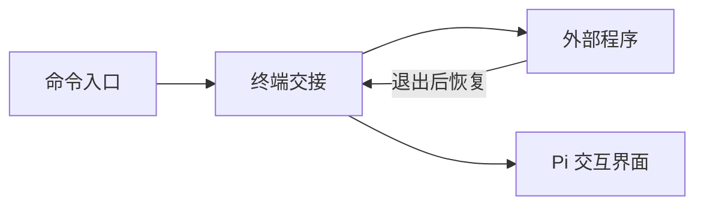

# terminal

## 功能简介

用 `/vim [file]`、`/lg`、`/fm` 启动编辑器、Git 界面和文件管理器，需要 TUI 模式。

## 架构



`index.ts` 注册命令；`../../shared/terminal-app.ts` 负责终端交接与程序启动。

## 配置

在 agent 目录的 `pi-kits.json` 中设置 `terminal`，修改后执行 `/reload`。以下为默认值：

```json
{
  "terminal": {
    "enabled": true,
    "editor": "nvim",
    "gitUI": "lazygit",
    "fileManager": "yazi"
  }
}
```

配置值是直接执行的程序，不是 shell 命令；需提前安装相应程序。

完整字段见[配置示例](../../pi-kits.example.json)。
