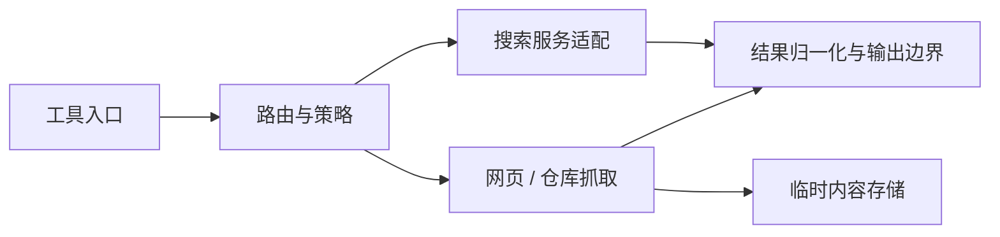

# web-kits

## 功能简介

提供 `web_search` 和 `web_fetch`：通过 SearXNG 或 Codex 搜索，获取网页及 GitHub 仓库内容。`/web-tools` 可查看配置和测试搜索服务。

## 架构



- `index.ts` 注册工具，`composition.ts` 组装搜索与抓取逻辑。
- `core/` 和 `providers/` 负责搜索路由与服务商适配。
- `fetch/` 负责 HTTP、GitHub 和临时内容文件；`schema.ts` 定义结构化输出。

详见[架构](docs/architecture.md)及[使用与开发](docs/usage.md)。获取的内容是不可信数据；本扩展不是网络安全沙箱，也不会自动执行仓库代码。

## 配置

在 agent 目录的 `pi-kits.json` 中设置 `web-kits`，修改后 `/reload`：

```json
{
  "web-kits": {
    "enabled": true,
    "search": { "routing": { "provider": "searxng" }, "maxResults": 5 },
    "fetch": { "github": { "enabled": true, "mode": "auto" } }
  }
}
```

SearXNG 使用 `SEARXNG_URL` 和可选的 `SEARXNG_API_KEY`；Codex 认证由 Pi 管理，GitHub 认证使用 `gh auth login`。搜索与抓取默认超时均为 15 秒，可独立关闭。

完整字段和工具参数见[配置文档](docs/configuration.md)。
