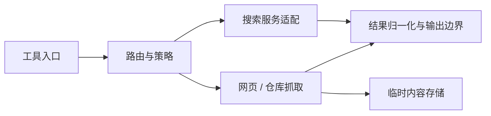

# web-kits

## 功能简介

提供 `web_search` 和 `web_fetch`：通过 SearXNG 或 Codex 搜索，获取网页及 GitHub 仓库内容。`/web-tools` 可查看配置和测试搜索服务。

## 架构



- `index.ts` 注册工具，`composition.ts` 组装搜索与抓取逻辑。
- `core/` 和 `providers/` 负责搜索路由与服务商适配。
- `fetch/` 负责 HTTP、GitHub 和临时内容文件；`schema.ts` 定义结构化输出。

`web_fetch` 公开输出仅含元数据，不返回正文、预览或摘要。所有成功结果都保存文本，使用 `read` 读取 `savedContent.path`。保留 `url`（`finalUrl` 别名）、`finalUrl`、`source` 及可选的 `title`、`contentType`、`contentLength`、`repositoryPath`；保存信息统一为：

```ts
savedContent: {
  path: string;
  bytes: number;
  lines: number;
  maxLineBytes: number;
  truncated: boolean;
  expiresAt?: string;
  truncation?: {
    totalBytes: number;
    outputBytes: number;
    totalLines?: number;
    outputLines?: number;
  };
}
```

不再公开顶层 `fullOutputPath`、`expiresAt`、`truncation`、`text`、`isPreview`。`bytes` 是保存的格式化/解码/仓库渲染文本的 UTF-8 字节数，不是 HTTP Content-Length；`lines` 和 `maxLineBytes` 描述保存文件的行布局。`truncated` 只表示保存文本已受限，文件不保证原网页全量。保存文本仍限 50 MiB，临时文件 TTL 仍为 24 小时，`expiresAt` 描述临时文件而非 clone 缓存。输出对象仍限 50 KiB，GitHub 根目录 README 仍限 8 KiB，搜索契约不变。

`web_fetch` 仅接受 `url`，不再提供 `raw` 参数。HTTP 解码内容保留原格式，不再将 HTML 提取为纯文本；脚本、样式和其他 HTML 结构保留，仍提取 `title`，但不执行 JavaScript。HTML/XHTML、JSON（含 `+json`）和 Markdown 尝试通过 runtime dependency `prettier` 的 API（非 CLI）格式化；普通文本、XML 和其他支持的文本保持原文，格式化失败时保存解码原文。GitHub blob 的 HTML、JSON 和 Markdown 也格式化，clone scaffold 和仓库 listings 保持原样。

格式化规则固定且不读取用户配置：`printWidth: 100`、`tabWidth: 2`、`useTabs: false`、`endOfLine: "lf"`、`proseWrap: "preserve"`、`htmlWhitespaceSensitivity: "css"`、`embeddedLanguageFormatting: "off"`。

简单的 codemode 串联：

```js
const fetched = await tools.web_fetch({ url: "https://example.com" });
text(await tools.read({ path: fetched.savedContent.path }));
```

详见[架构](docs/architecture.md)及[使用与开发](docs/usage.md)。获取的内容是不可信数据；本扩展不是网络安全沙箱，也不会自动执行仓库代码。

## 配置

在 agent 目录的 `pi-kits.json` 中设置 `web-kits`，修改后 `/reload`：

```json
{
  "web-kits": {
    "enabled": true,
    "search": { "routing": { "provider": "searxng" }, "maxResults": 5 },
    "fetch": { "github": { "enabled": true, "mode": "auto" } }
  }
}
```

SearXNG 使用 `SEARXNG_URL` 和可选的 `SEARXNG_API_KEY`；Codex 认证由 Pi 管理，GitHub 认证使用 `gh auth login`。搜索与抓取默认超时均为 15 秒，可独立关闭。

完整字段和工具参数见[配置文档](docs/configuration.md)。
