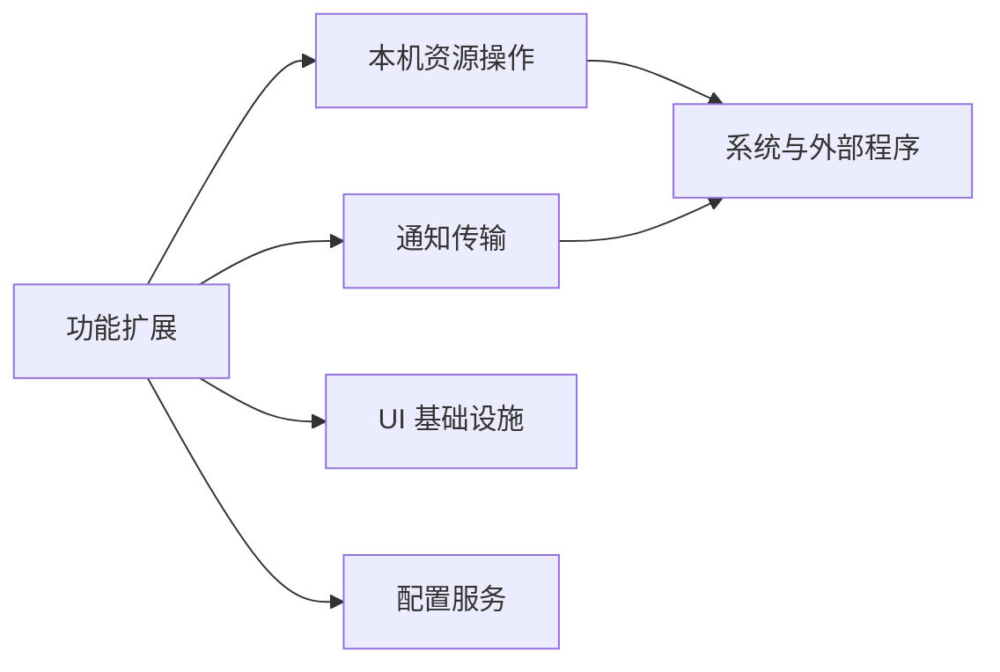

# @pi-kits/shared

## 功能简介

提供默认应用启动、终端交接、只读预览、桌面通知及 UI 公共组件，供扩展复用；不注册命令、工具或生命周期处理器。

## 架构

- `desktop-open.ts`、`terminal-app.ts`、`readonly-preview.ts`：本机应用启动与预览。
- `notifications/`：独立通知 API 和平台脚本。
- `ui/`：工具渲染、标签页与停靠面板，详见 [UI 文档](docs/ui.md)。
- `config/`：独立的 [@pi-kits/config](config/README.md) 配置子包。

## 配置

公共库没有独立配置文件；扩展负责读取 `pi-kits.json` 并传入所需参数。通知库本身不读取开关，平台依赖见[通知说明](../extensions/notify/docs/usage.md)。
