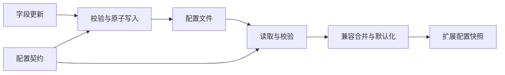

# @pi-kits/config

## 功能简介

统一读取、校验和默认化 `pi-kits.json`，并支持保留其他字段的原子更新。

## 架构

`schema.ts` 定义 TypeBox 配置契约；`index.ts` 提供路径解析、文件读写、旧配置兼容和默认值。此包不注册 Pi 扩展能力。

## 配置

默认读取 `~/.pi/agent/pi-kits.json`，agent 目录遵循 Pi 的 `PI_CODING_AGENT_DIR`。文件缺失使用默认值；无效或不可读文件报错，修改后 `/reload`。

扩展通过各自顶层设置的 `enabled` 控制。完整字段见[配置示例](../../pi-kits.example.json)和 [JSON Schema](../../pi-kits.schema.json)，旧分组兼容规则见[配置说明](docs/configuration.md)。
