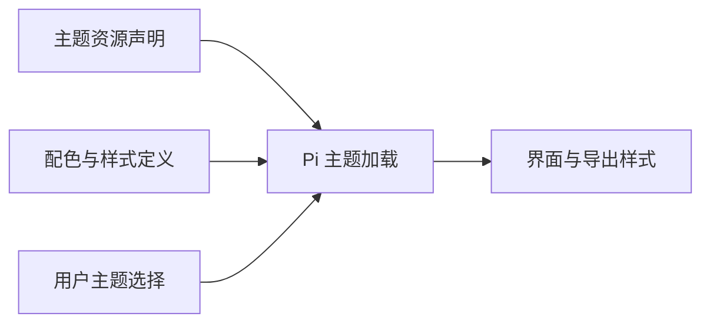

# pi-kits-themes

## 功能简介

提供 Pi 的 Gruvbox 主题。

## 架构

```mermaid
flowchart LR
  A["主题资源声明"] --> B["Pi 主题加载"]
  C["配色与样式定义"] --> B
  D["用户主题选择"] --> B
  B --> E["界面与导出样式"]
```

`gruvbox.json` 定义主题变量、界面颜色和导出样式；`package.json` 显式声明主题资源，不加载扩展代码。

## 配置

在 Pi 的 `/settings` 中选择 `gruvbox`。无需修改 `pi-kits.json`。
